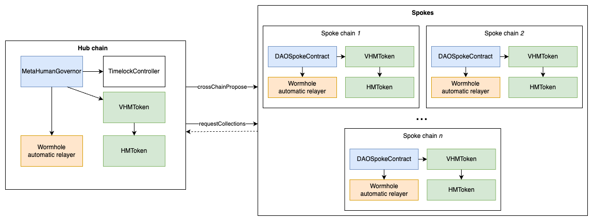

# Project README

## Overview

This project contains the smart contracts developed for the MetaHuman Governance project. These contracts facilitate various
functionalities related to governance and cross-chain communication.

## Architecture
This governance protocol uses Hub-Spoke architecture.

#### Hub chain
- `MetaHumanGovernor` contract is the Hub. This is the contract where proposals are created and executed. The implementation is based on [OpenZeppelin's Governor](https://docs.openzeppelin.com/contracts/4.x/api/governance#Governor).
- `TimelockController` is the [Timelock implementation](https://docs.openzeppelin.com/contracts/4.x/api/governance#TimelockController) from [OpenZeppelin Governance primitives](https://docs.openzeppelin.com/contracts/4.x/api/governance).
- `HMToken` is the [Human Token](https://www.humanprotocol.org/hmt).
- `VHMToken` is the [ERC20Wrapper](https://docs.openzeppelin.com/contracts/4.x/api/token/erc20#ERC20Wrapper) that enables 1 to 1 exchange for `HMToken`.

#### Spoke chain
- `DAOSpokeContract` is the Spoke implementation. This contract allows users to vote on proposals.
- `HMToken` and `VHMToken` are the same implementations as on the Hub chain.

#### Wormhole cross chain communication
Cross chain communication is achieved by using [Wormhole automatic relayer](https://docs.wormhole.com/wormhole/quick-start/cross-chain-dev/automatic-relayer).

This mechanism is used in two steps of the flow:
- `crossChainPropose` - Broadcast proposals created on Hub to be also available on Spoke chains.
- `requestCollections`- Collecting the votes from Spokes to Hub

## Contracts

⚠️ When deploying contracts please confirm that parameters marked `TODO:prod` are correctly set up. ⚠️

### MetaHumanGovernor

The `MetaHumanGovernor` contract is responsible for governance functionalities. It implements
the `Governor`, `GovernorSettings`, `GovernorVotes`, `GovernorVotesQuorumFraction`, and `GovernorTimelockControl`
interfaces. It allows token holders to propose and vote on proposals, and execute approved proposals through a timelock
mechanism. Additionally, it supports cross-chain communication using the `IWormhole` contract.

### DAOSpokeContract

The `DAOSpokeContract` contract serves as a spoke contract in a cross-chain governance setup. It allows token holders to
cast votes on proposals and participate in the governance process. The contract interacts with the `IWormholeReceiver` and `IWormholeRelayer` contracts
for cross-chain communication.

### CrossChainGovernorCountingSimple

The `CrossChainGovernorCountingSimple` contract provides counting functionality for cross-chain governance. It extends
the `Governor` and `Ownable` contracts and implements cross-chain voting counts. It maintains mappings and structures to
track proposal votes from different spoke contracts. The contract interacts with the `IWormholeReceiver` and `IWormholeRelayer` contracts
for cross-chain communication.

## Dependencies

The project relies on the following external dependencies:

- OpenZeppelin contracts: version 4.x.x
- Solidity: version 0.8.0

## Setup and Deployment

To set up and deploy the contracts, follow these steps:

1. Install Foundry. [Installation guide](https://book.getfoundry.sh/getting-started/installation), require [Nightly (2023-08-02)](https://github.com/foundry-rs/foundry/releases/tag/nightly-ca67d15f4abd46394b324c50e21e66f306a1162d) version.
2. Prepare `.env` file based on provided [.env.example](.env.example).
3. Fill out private keys, rpc urls, magistrate address and Etherscan api keys.
4. Follow instructions from [Deployment guide](DEPLOYMENT_GUIDE.md).

## Usage

Once deployed, the contracts can be interacted with using Ethereum addresses and appropriate function calls. Refer to
the contract documentation for detailed information on each contract's functionality and available methods.

## Testing

To run smart contracts unit tests, please run `forge test` command.

To see current coverage, please run `forge coverage`.

## Generate documentation

Code documentation can be generated using the `forge doc` command.

For details please refer to the [official documentation](https://book.getfoundry.sh/reference/forge/forge-doc)

## Contributing
...
## License
...
