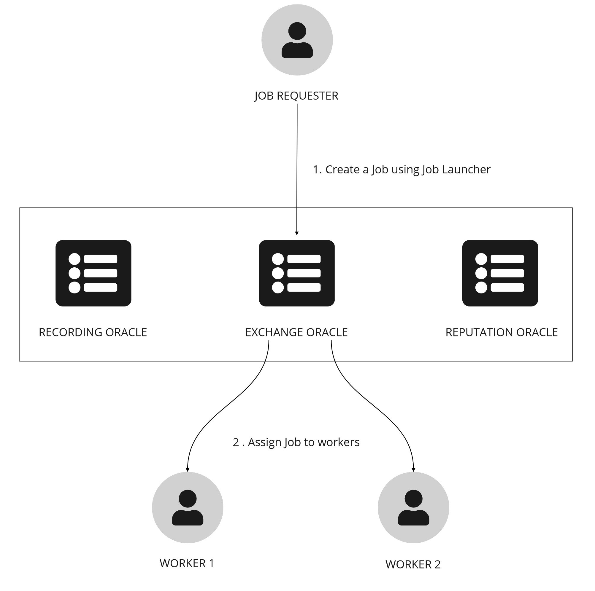
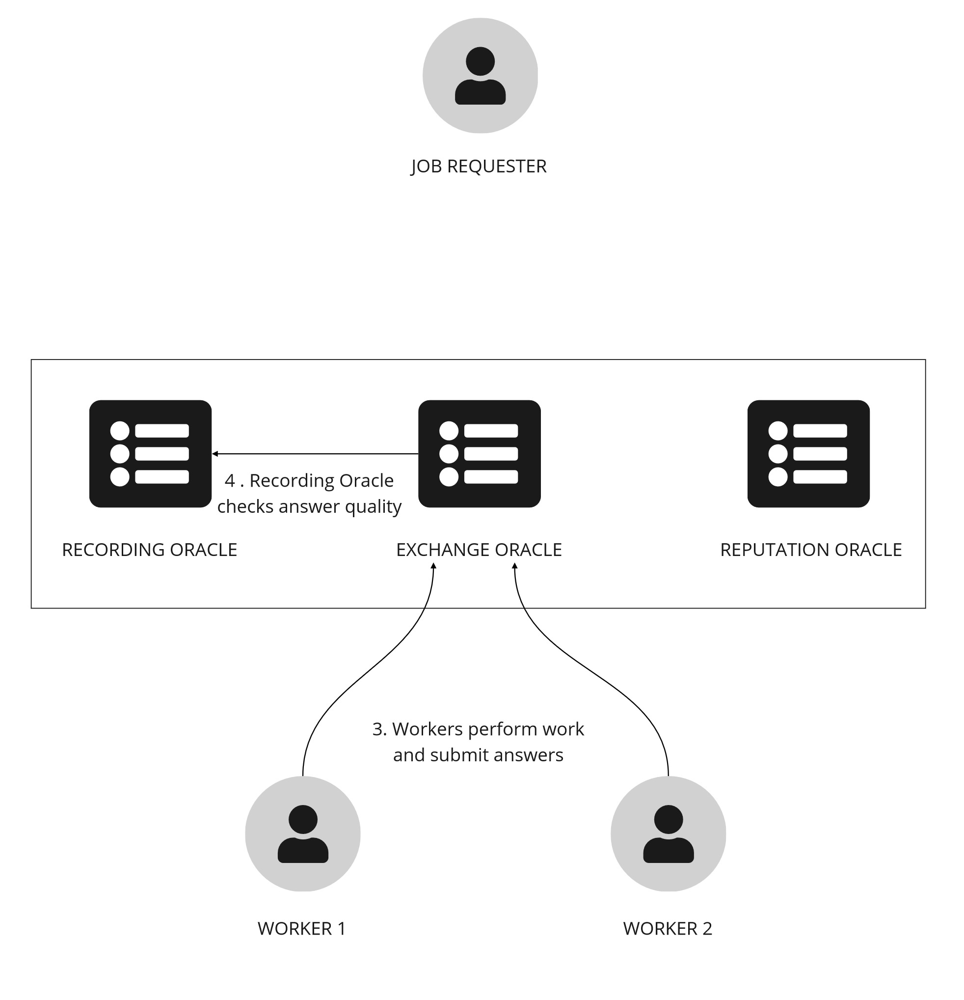
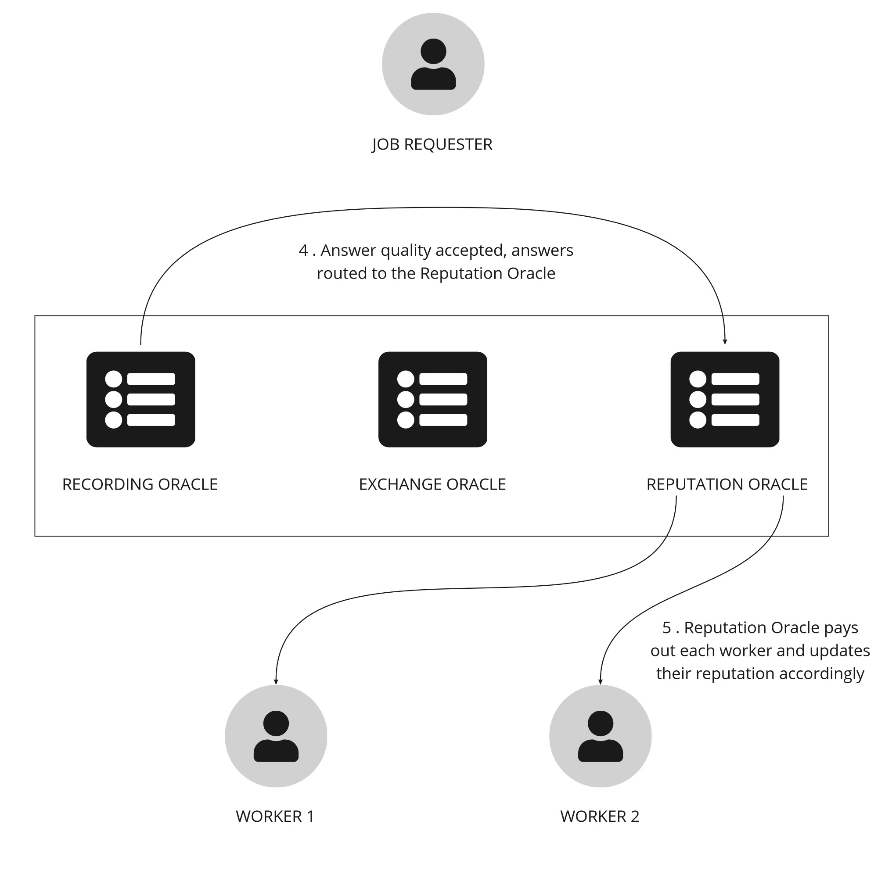

# Fortune

Welcome to Fortune, an example HUMAN application that demonstrates how to create and fulfill job requests using the HUMAN protocol.

## How it works

In this specific usecase a job requester is requesting a fortune prediction from a group of workers (Fortune Tellers). Each Fortune Teller will provide their answers, which will then be verified and settled by a group of Oracles.

## High Level Overview

At a very high level this project consists of 4 main components (smart contracts):

**Launcher (Job Launcher)** - The Job Launcher is factory which creates new escrow contracts. A job requester can then add Job details (as a mainfest) and fund the escrow.

**Exchange Oracle** - An Ethereum Oracle that interacts with people or bots to fufill the job.

**Recording Oracle** - An Ethereum Oracle which records the task output and who does what. In this case, the Recording Oracle will receive responses from the Exchange Oracle.

**Reputation Oracle** - An Ethereum Oracle which pays workers for the jobs performed, based on their reputation within the oracle network. In this case, the Reputation Oracle collects all the responses from the Recording Oracle and pays out the Worker and the Recording Oracle.

### User Persona's in this demo

**Job Creator/Requester** - The entity/person who wants some work performed.

**Worker (Fortune Teller)** - The entity/person who performs the actual work.

## Process Flow

### Job Submission and Routing

1. The Job Requester, using the Job Launcher client, fills a form with the job information and approves to the Job Launcher to use the amount of tokens desired for funding the escrow.
2. The Job Launcher uploads a file with job details(manifest), creates an escrow, funds it and adds the job manifest url.

3. Once the job is registered on-chain the Exchange Oracle picks up the job and routes it to Workers.



### Job Fulfillment and Answer Quality

4. Workers perform the task and submit their responses (answers) back to the Exchange Oracle.

5. The Exchange Oracle passes the responses to the Recording Oracle, which then checks the quality of answers. If the quality is acceptable the answers are then routed to the Reputation Oracle.



### Settlement

5. The Reputation Oracle calculates a threshold based on certain job request parameters. If the answers pass the threshold it pays workers and updates the reputation scores for each worker.



# Usage Instructions

There are two options to run the example, use our deployed playground example and run the example locally using node.

## Deployed Playground

To use the deployed (hosted) example all you need is a metmask wallet with the Fortune Ethereum Testnet configured. Download and install Metamask from www.metamask.io.

### Metamask Configuration for Deployed Playground

To configure Metamask for the deployed playground example:

1. Go to [job launcher ](https://job-launcher.humanprotocol.org/) and check the available networks in the network dropdown. Choose one of the networks and then go to https://chainlist.org/?testnets=true and search for it and click on "Add to metamask" (we suggest to use Mumbai). You can skip this step if you already have the network configured on your metamask wallet.

2. Next we will need 3 accounts to represent each person in this example (Job requester, Worker 1 and Worker 2).

3. The final step in configuring Metamask is to import the HMT Token for each of the accounts above. Click on 'Import tokens', located at the bottom of the 'Assets' tab on your wallet homepage and add the Token Contract Address from this [list](https://github.com/humanprotocol/human-protocol/blob/main/CONTRACTS_LIST.md) according to the network selected in step 1. Repeat this process for each of the 3 accounts. Congratulations we have successfully configured Metamask and can proceed to interact with the Job Launcher to create new Jobs!

### Creating a Job using crypto for deployed Playground

In Metamask, using your Job Requester account:
1. You need to have HMT tokens in the network you want to create the job. ([Faucet](https://dashboard.humanprotocol.org/))
2. Navigate to [Job Launcher](https://job-launcher.humanprotocol.org/) to access the Job Launcher.
3. Click on Crypto and connect your metamask wallet. Ensure that you are connected to desired network in Metamask.
4. Fill the job request form and click on "Fund and Request Job" (in fortunes requested choose 2).
5. Wait until the job is created and you should see your escrow address.

The job creation is now complete!

### Creating a Job using Fiat for deployed Playground

In Metamask, using your Job Requester account:
1. Navigate to [Job Launcher](https://job-launcher.humanprotocol.org/) to access the Job Launcher.
3. Click on Fiat.
4. Fill the job request form and click on "Fund and Request Job" (in fortunes requested choose 2). Use `4242424242424242` as the card number, any number as CVC and a future date as expiration date.
5. Wait until the job is created and you should see your escrow address.

The job creation is now complete!

### Viewing Jobs

The job has now been created and is available for exchanges to pick up. To view the job status navigate to the [Exchange Oracle](https://exchange.humanprotocol.org/) and paste the Escrow contract address. The status should be 'Pending'. Jobs in a pending status are picked up by the exchange and forwarded to workers.

### Fulfilling a job

To fulfil this job we require answers (fortunes in our case) from 2 workers.

1. In your Metamask wallet switch to the Worker 1 account that you created above. Navigate to the [Exchange Oracle](https://exchange.humanprotocol.org/) and enter a fortune prediction (any text).

2. Now switch to Worker 2 and enter a fortune prediction (it should be different from Worker 1).

We have now provided 2 predictions from 2 Workers. Lets check the status of the job again by navigating to the [Exchange Oracle](https://exchange.humanprotocol.org/)

You should see account balance for Worker 1 and 2 has increased by the relevant amount.

## Running Locally with Node

First we must get:
- A new WalletConnect projectID. To do so go to https://cloud.walletconnect.com and register a new project. Once we get that, go to Exchange directory and complete the environment variables file with the projectId obtained.
- Stripe keys from https://stripe.com and set them in environment variables of job launcher server.

Then execute the following command:

```
yarn && yarn local
```

At this point we have a Local Testnet running with our contracts deployed to a Hardhat testnet node. The next step is to configure Metamask to work with our Local Testnet.

Go to this section to see [local network usage.](#local-network-usage)

# Local network usage

### Metamask Configuration for Local Testnet

To configure Metamask for the Local Testnet example:

1. Open your Metamask wallet and click on the account icon in the top right. Select Settings > Networks > Add Network. Enter the details below:

- Network Name - any name. We are using `Fortune` for this example
- New RPC URL - http://localhost:8545
- Chain ID - `1338` (you may get a warning here that this ID is already in use, it is safe to ignore)
- Currency Symbol - `ETH`

2. Next we will need 3 accounts to represent each person in this example (Job requester, Worker 1 and Worker 2). In Metamask, click on your account icon in the top right and select Import Account. From this screen you can enter a private key to add an account. Repeat this process for each of the keys below:

|               | Node (Hardhat)                                                   |
| ------------- | ---------------------------------------------------------------- |
| Job Requester | ac0974bec39a17e36ba4a6b4d238ff944bacb478cbed5efcae784d7bf4f2ff80 |
| Worker 1      | 7c852118294e51e653712a81e05800f419141751be58f605c371e15141b007a6 |
| Worker 2      | 47e179ec197488593b187f80a00eb0da91f1b9d0b13f8733639f19c30a34926a |

(In case you are wondering where these private keys are from, they correspond to the standard accounts from a Ganache setup and are pre-funded with testnet HMT).

3. The final step in configuring Metamask is to import the HMT Token for each of the accounts above. Click on 'Import tokens', located at the bottom of the 'Assets' tab on your wallet homepage and add the following Token Contract Address for the HMT Token:

   - **HMT**: `0x5FbDB2315678afecb367f032d93F642f64180aa3`

   Repeat this process for each of the 3 accounts. Congratulations we have successfully configured Metamask and can proceed to interact with the Job Launcher to create new Jobs!

### Creating a Job (Local Testnet)

1. In Metamask, switch to the Job Requester account that you imported above.
2. Ensure that you are connected to Fortune local network under Networks in Metamask.
3. Navigate to http://localhost:3000 to access the Job Launcher.
4. Click on Crypto and connect your metamask wallet. Ensure that you are connected to desired network in Metamask.
5. Fill the job request form and click on "Fund and Request Job" (in fortunes requested choose 2).
6. Wait until the job is created and you should see your escrow address.

The job creation is now complete!

### Viewing Jobs

The job has now been created and is available for exchanges to pick up. To view the job status navigate to the exchange service (http://localhost:3001) and paste in the Escrow contract address.

The status should be 'Pending'. Jobs in a pending status are picked up by the exchange and forwarded to workers.

### Fulfilling a job

To fulfil this job we require answers (fortunes in our case) from 2 workers:

1. In your Metamask wallet switch to the Worker 1 account that we imported above. Navigate to exchange service (http://localhost:3001) and enter a fortune prediction (any text).
2. Now switch to Worker 2 and enter a fortune prediction (it should be different from Worker 1).

We have now provided 2 predictions from 2 Workers. Lets check the status of the job again by navigating to the exchange service . You should also see that the account balances for Worker 1 and 2 have increased by the relevant amount. 

# Tests

## Unit tests

```
yarn && yarn test:unit
```

## End to end tests (temporally disabled)

### Using Hardhat

```
yarn && yarn test:e2e
```

## Unit & e2e tests

```
yarn && yarn test
```

# Troubleshooting

Error: The tx doesn't have the correct nonce or the transaction freezes.

Fix: If you experience errors such as this when submitting transactions, try resetting Metamask by clicking on the account icon (top right) then Settings > Advanced > Reset Account.

If you encounter any other issues when using the front end, please use the developer console 'Ctrl+Shift+I (Command+Option+I on Mac)' in Chrome/Firefox to diagnose errors when submitting transactions from the front-end.

# Conclusion

In this example we have demonstrated the steps involved in creating and fulfilling jobs on the HUMAN protocol. This is a very basic example which could easily be extended to other use case's. If you have any problems with the setup or usage of this example, please open an issue and let us know! Feel free to check out the HUMAN github repostory for other useful resources.
